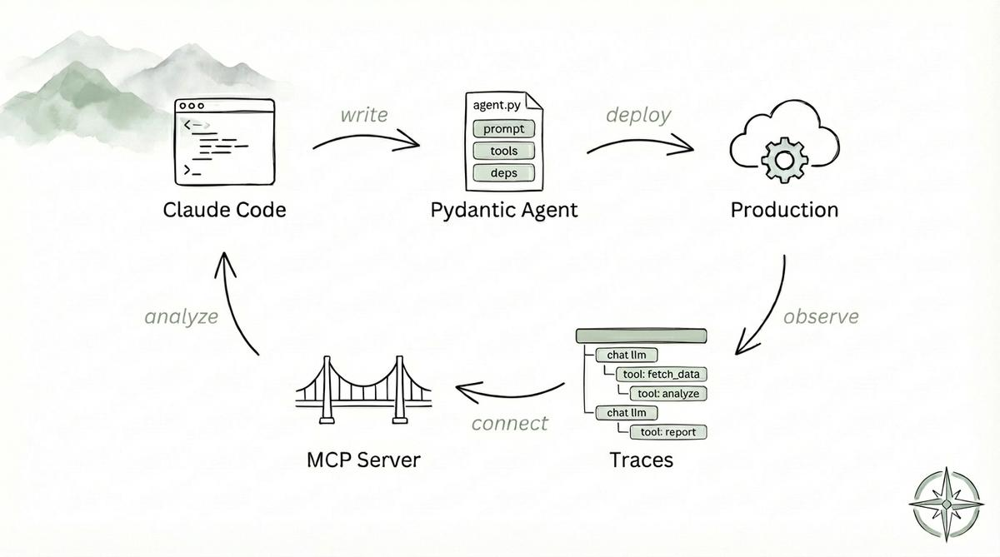
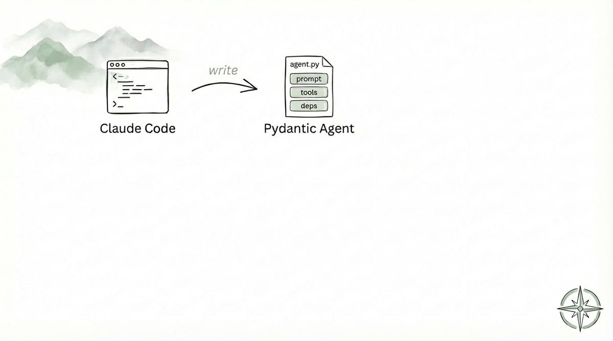
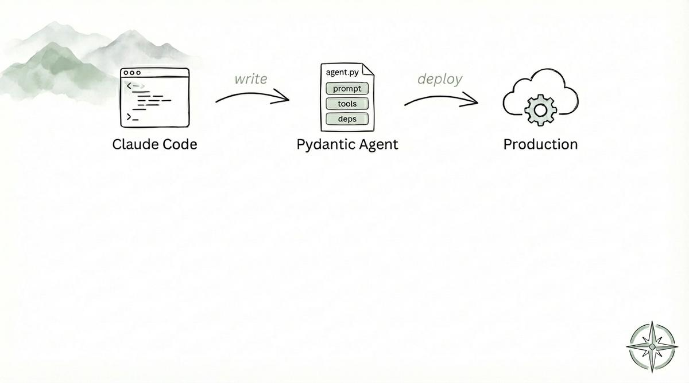
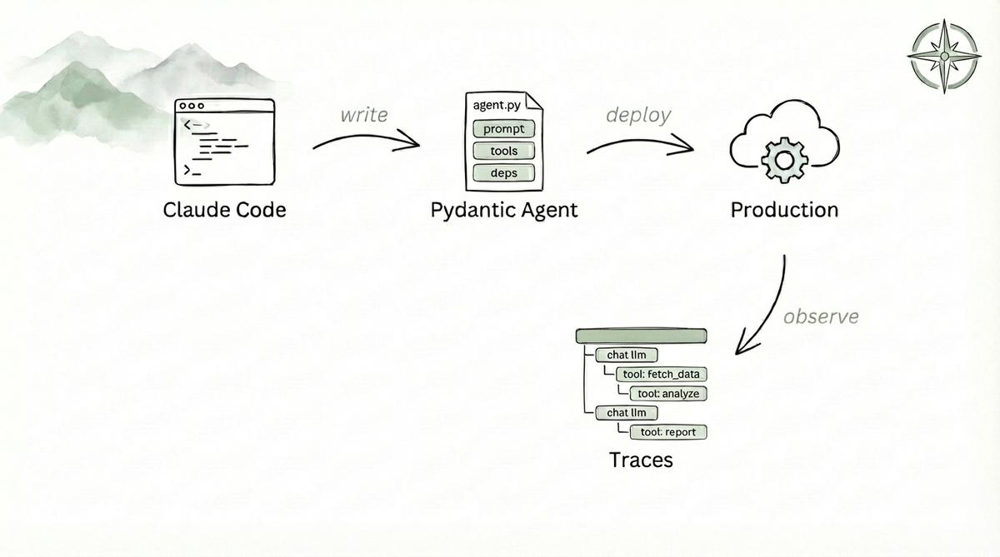
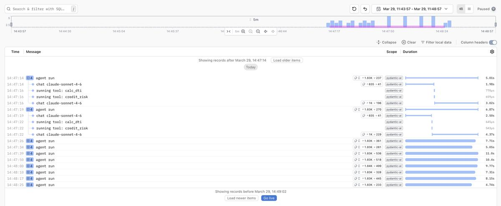
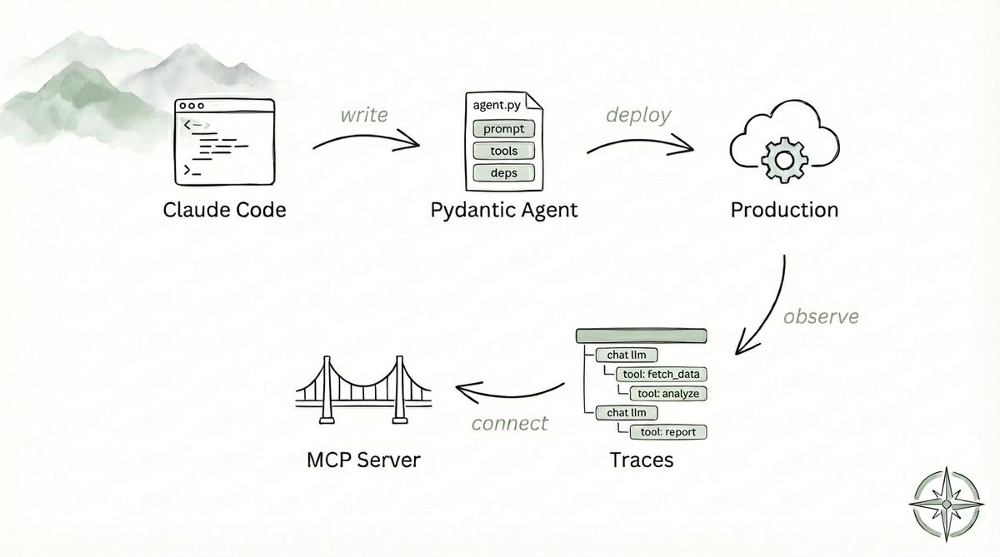

## Self-improving agent

TLDR: Build a self-improving production agent with [Claude Code](https://docs.anthropic.com/en/docs/claude-code/overview), [Pydantic AI](https://ai.pydantic.dev/), and [Logfire](https://pydantic.dev/logfire). This is our flow and plan for today.



## What is a self-improving agent?

There are so many different definitions of this, and some people would argue. My approach is practical—I've used this pattern so many times in real production, and it blows my mind every time!
You build the agent for a use case with Claude Code, you deploy it to make it available to your users, you connect a coding agent to an observability system to collect real user requests and agent traces, and based on that you generate the next version of your agent. Simple, reviewable, and with a human in control!

Let's do an example step by step! 


## Build your agent 

Let's start simple—build a sample agent for demo purposes to see how it can improve automatically later on. Of course, we are going to use Claude to build it. 




There are many different frameworks to build agentic and multi-agent systems—I recently started using Pydantic AI and it's great. Alternatives such as [CrewAI](https://github.com/crewAIInc/crewAI), [LangGraph](https://github.com/langchain-ai/langgraph), [OpenAI Agents SDK](https://github.com/openai/openai-agents-python), [Strands Agents](https://github.com/strands-agents/sdk-python), [Google ADK](https://github.com/google/adk-python), [Smolagents](https://github.com/huggingface/smolagents), [Mirascope](https://github.com/Mirascope/mirascope) are viable options as well.


For a simple demonstrative agent, Claude can one-shot it, but I still prefer plan mode.

```bash
input="Build a simple PydanticAI agent. Make sure to add tools and dependencies. Tools should hold deterministic logic, and the LLM should handle non-deterministic logic. 
Use the Anthropic model. Use a simple financial industry-specific example, such as investment, insurance, underwriting, etc. The agent should be multi-step. Keep the code simple (< 50 lines).

PydanticAI reference (read them before build): 

https://ai.pydantic.dev/llms.txt
https://ai.pydantic.dev/llms-full.txt

Structure the agent as a CLI and use uv run to test it. Put the code into src/agent/agent.py" 

claude -n "self-improving-agent" "$input" --permission-mode plan --allowedTools "WebFetch"
```

The output of this planning is here: ./plans/agent-plan.md

[agent-plan](./plans/agent-plan.md)


Once you're happy with the plan—the LLM can one-shot it easily for such a simple agent.

```bash
claude -r "self-improving-agent" "read plans/agent-plan.md and implement it"
```

NOTE: in real production—interaction, task breakdown, and iterations help a lot.

## Deploy your agent

Now you need to expose the agent to your users.



This can be done in several ways—API, async processing, batch—everything depends on your context (I have a full part of my course dedicated just to this: [Serving Basics](https://edu.kyrylai.com/courses/serving-basics-ml-in-production), [Serving Advanced](https://edu.kyrylai.com/courses/serving-avanced-ml-in-production)). For demonstration purposes, today I'll just use it as a CLI with several hard cases.

```bash
input="Generate hard cases to stress-test the agent to the edge, structure as a CLI tool with input samples as JSON."

claude -r "self-improving-agent" "$input" --permission-mode plan
```

[agent-test](./plans/agent-test.md)

And once again—plan looks good—one-shot it:

```bash
claude -r "self-improving-agent" "read plans/agent-tests.md and implement it"
```

After implementation is done—ask Claude or run the samples yourself (unless it's already done as part of your plan)


```bash
uv run agent-eval
```

NOTE: in real production—samples from an LLM are better than nothing, but they should come from real users, not an LLM. Otherwise, you might be at risk of optimizing the wrong piece.


## Observe your agent: 

Now the next step is to make sure your agent submits traces. 



Now you have an agent, users are using it—let's make sure we store its traces.

What are traces? Agents are basically dynamic workflows—for each input, a unique set of LLM calls, actions, and decisions. Each run is a unique trace. Believe me—you want to record those. Think of them as request traces in distributed systems.

With Pydantic AI and Logfire, you can just add 2 lines to your agent and everything will be recorded:


```bash
claude -r "self-improving-agent" "make sure my traces from agent are recorded in logfire add: logfire.configure();logfire.instrument_pydantic_ai() to core code and re-run all samples, make sure traces are in logfire"
```

NOTE: to use Logfire - create an account and add LOGFIRE_TOKEN as an env variable

Now every time someone is using your agent, you can see exactly what happens:



NOTE: Logfire could be replaced with any LLM observability tool here (I use Datadog LLM observability most of the time)—for example [Braintrust](https://www.braintrust.dev/), [Datadog LLM Observability](https://www.datadoghq.com/product/llm-observability/), [Langfuse](https://langfuse.com/)

## Connect Claude Code to traces 

Make traces accessible to Claude Code:



It's great that we have traceability and understand what's happening, but it's important to make sure somebody else can access the traces too. Who, you ask? Our coding agent, of course!


```bash
claude mcp add logfire --transport http https://logfire-us.pydantic.dev/mcp
```

This way, Claude can query your production traces directly.

## Self improve! 


And now we are ready to close the loop!


```bash
claude "Analyze my Loan Underwriting Agent agent traces from Logfire for last day, use logfire mcp. Find mistakes, inefficiencies, and propose improvements to my agent - prompt, tools, flow, etc" --permission-mode plan
```

Recommendations to improve your agents are here, and they are based on actual data points. 

[agent-improvement-v1](./plans/agent-improvement-v1.md)


Mix them with domain expert review and notes, and you have a very solid next iteration.
Now you are back at step 1, "Build your agent," but better, more confident, and with actual data points. You can automate this, you can review each step, you can build on top of this! 


## Conclusion:

This is a pattern I use all the time at large scale. It's extremely scalable and useful. The ROI for improving agents from production traces is insane—worth every token and every minute/hour of setup!

Next progression of this would be to add scoring and evaluation of traces and add these signals to coding agents as well—but that's a topic for the next blog posts.

Code and plans are here: https://github.com/kyryl-opens-ml/self-improving-agent